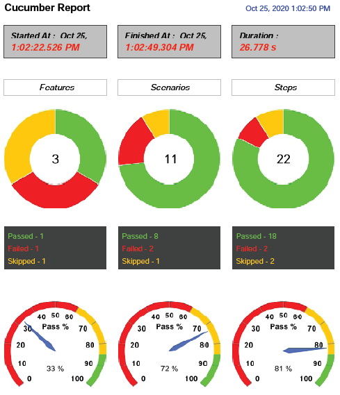

This deals with generating **Extent reports for Cucumber-JVM version 6** using the ExtentReports Cucumber **Adapter Plugin**. For more details refer to this [article](http://grasshopper.tech/2098/). A sample usage of this adapter can be found [here](https://github.com/grasshopper7/cuke6-extent-adapter-report).

To **build** from source use ```install -Dmaven.test.failure.ignore=true``` or ```install -Dmaven.test.skip=true```. This ignores intentional test failures from stopping the build.

**Dependency** - To work with the latest [ExtentReports version 5](https://github.com/extent-framework/extentreports-java/wiki), which includes support for latest **Spark, PDF *(New Feature, check 'Extent PDF Reporter' section below)*, Klov and Json** reporters, add the below dependency. The HTML and Logger reporters, among others, have been deprecated. For more details refer to the **POM Dependencies** section of the [article](http://grasshopper.tech/2098/).

```
<dependency>
    <groupId>tech.grasshopper</groupId>
    <artifactId>extentreports-cucumber6-adapter</artifactId>
    <version>2.4.0</version>
</dependency>
```

To work with the older ExtentReports version 4, add the below dependency.

```
<dependency>
    <groupId>tech.grasshopper</groupId>
    <artifactId>extentreports-cucumber6-adapter</artifactId>
    <version>1.2.0</version>
</dependency>
```

**Report Attachments** - To add attachments, like screen images, two settings need to be added to the extent.properties. First property, named **screenshot.dir**, is the directory where the attachments are stored. Second is **screenshot.rel.path**, which is the relative path from the report file to the screenshot directory. For more details refer to the **Report Attachments** section of the [article](http://grasshopper.tech/2098/).

```
extent.reporter.spark.out=test-output/SparkReport/Spark.html

screenshot.dir=test-output/
screenshot.rel.path=../
```

**Extent PDF Reporter** *(NEW FEATURE)* - The PDF reporter summarizes the test run results in a **dashboard** and other sections with **feature, scenario and step details**.



The PDF report is needs to be enabled in the extent.properties file.
```
extent.reporter.pdf.start=true
extent.reporter.pdf.out=test output/PdfReport/ExtentPdf.pdf
```
The default color settings can be modified by using a YAML config file, named pdf-config.yaml in the project src/test/resource folder. The detailed documentation for this feature is available in this [article](http://grasshopper.tech/2224/).

**Customized Report Folder Name** *(NEW FEATURE)* - To enable report folder name with date and\or time details, two settings need to be added to the extent.properties. These are **basefolder.name** and **basefolder.datetimepattern**. These will be merged to create the base folder name, inside which the reports will be generated. The basefolder.datetimepattern value should be a **valid date time formatter pattern**. For more details refer to the **Customized Report Folder Name** section of the [article](http://grasshopper.tech/2098/).

```
extent.reporter.spark.out=test-output/SparkReport/

screenshot.dir=test-output/
screenshot.rel.path=../

basefolder.name=reports
basefolder.datetimepattern=d-MMM-YY HH-mm-ss
```

With the above settings, a base folder with the name '**reports 10-Aug-20 10-25-50**' will contain the reports. Screenshots if any, will be located inside the '**reports 10-Aug-20 10-25-50/test-output**' folder structure. Similarly the report will be created in the '**reports 10-Aug-20 10-25-50/test-output/SparkReport**' folder structure.

**Environment or System Info Properties** *(NEW FEATURE)* - It is now possible to add environment or system info properties in the extent.properties or pass them in the maven command line. The key string should begin with the prefix - 'systeminfo.'. **Be careful of the dot at the end**. For more details refer to the **Environment or System Info Properties** section of the [article](http://grasshopper.tech/2098/).

```
systeminfo.os=windows
```
